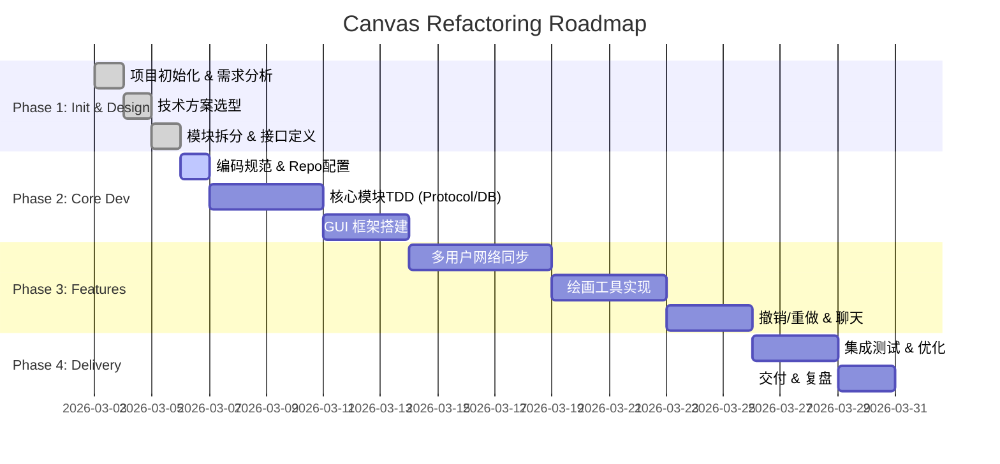

# Canvas Refactoring Project

## 项目章程 (Project Charter)

### 1. 项目目标
重构整个 Canvas 工程，实现一个支持多用户实时协作的绘画与聊天应用。

### 2. 核心功能需求
- **基础功能**: 文件保存/打开 (自定义格式/标准格式)。
- **用户系统**: 注册、登录、权限管理。
- **绘画功能**: 自由画笔、橡皮擦、撤销/重做、画布清理。
- **协作功能**: 多用户实时同步绘画、实时聊天室。
- **项目管理**: 简单的项目列表管理。
- **数据存储**: 数据库设计 (用户信息、项目元数据)。

### 3. 技术栈
- **语言**: C (C11/C17)
- **GUI**: GTK 3 (C API)
- **图形库**: Cairo
- **网络**: libwebsockets (C)
- **数据交互**: cJSON
- **数据库**: MySQL 8.x C API
- **构建系统**: CMake
- **平台**: PC (Linux/Windows)

### 4. 验收标准
- 代码符合 **Linux Kernel Coding Style** 或 **MISRA-C 2012**。
- 单元测试覆盖率 > 90% (使用 Unity/CMocka)。
- 多用户绘画延迟 < 100ms。
- 内存泄漏为 0 (Valgrind 检测)。

## 项目进度 (Gantt Chart)

## 当前状态
- **Task-1**: 需求澄清 & 技术方案选型
